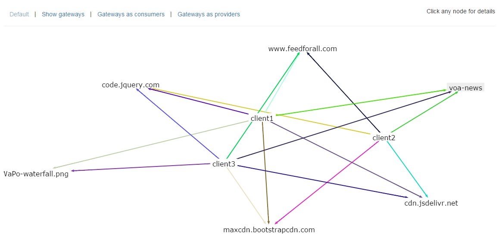
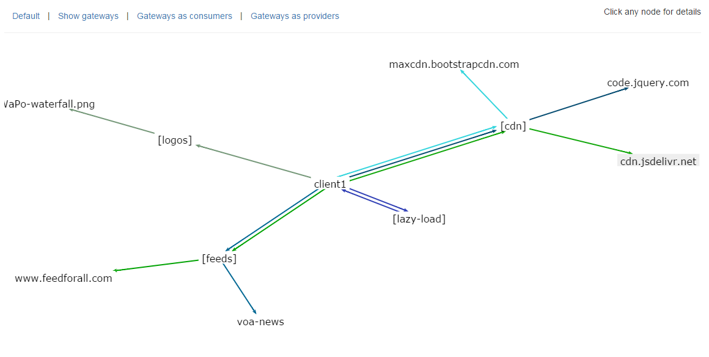

#API Call Mapping

**See Also:** [Examples Extension](https://github.com/EurActiv/VSAC-Examples) | [Example Logging Controller](https://github.com/EurActiv/VSAC-Examples/blob/master/examples/plugins/example-plugin/example-controller-logging.php)

The application will generate call maps to help you map your service oriented architecture.  By default, it is configured to store mapping for the core plugins.  You can change this behavior by overriding the `callmap_driver` setting in the plugin configurations frome `sqlitecallmap` to `noopcallmap`.

A callmap the architecture overview looks something like this:

You can drill down to get more detail on individual elements in the callmap. A map that looks at what a single client application is doing looks something like this:

To make a plugin/controller callmap aware, call the function `callmap_log`, which has the following signature:

    /**
     * Log a call in the callmap log
     *
     * @param string $provider the provider (aka, the application answering the call)
     * @param string $consumer the consumer (aka, the application making the call),
     * will be extracted from Referer header if not set.
     * @param string $gateway the gateway in this application, usually the current
     * plugin or the current plugin + controller
     *
     * @return void
     */
    function callmap_log($provider, $consumer = null, $gateway = null)

To add services to the callmap without writing an entire plugin, you can use the built-in [call-log service](../plugins/call-log).

