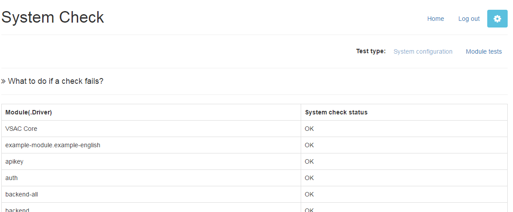

#Installation

**See Also:** [Server Configuration](./server-config.md) | [Application Configuration](./configuration.md)

Instalation is pretty easy:

  1. Download the [application.phar](../../application.phar) and upload it to your webserver, outside of the document root.
  * Download any vendor-specific PHAR archives and upload them as well, ideally in the same place
as `application.phar`.
  * In a console, run `$ php /path/to/application.phar install`.  Ideally, run the script as the webserver user so that the readability/writability checks work.
  * Answer the questions it asks about where to install the application. You'll need to know where your document root is and have a writable directory, the paths to any vendor extension PHAR archives and the path to where your vendor-specific extension(s) should be created.
  * The installer will create an install called install.php in your current working directory. Review it (eg, `$ vi "$(pwd)/install.php"`) and then run it with PHP (eg, `$ php "$(pwd)/install.php"`).

When done, go to `http://[your-server]/[path/to/application/]system-check.php` to make sure everything works. You should see something like this:

